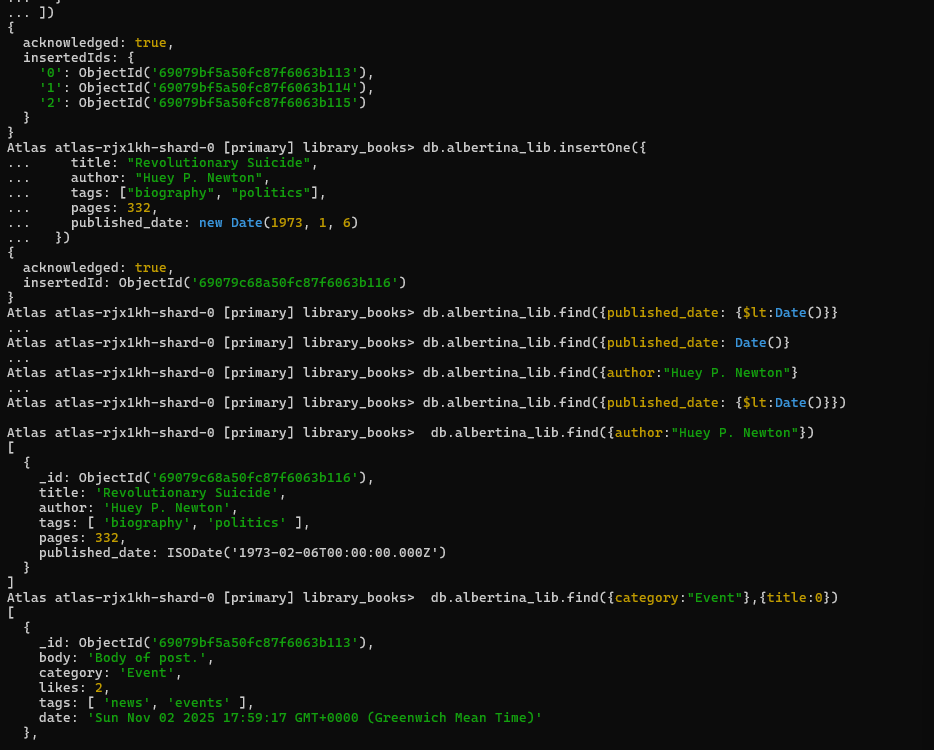

# Connecting to MongoDB via terminal
1. Execute the mongo shell
    It will prompt you, enter the  'mongodb+...' connection string
2. 'show dbs' to show DB
3. Can insert using the type of queries below

# Connecting via node.js code, locally 
Go to 'C:\x\x\Code Projects\library_books' and run 'node mongo_db.js'